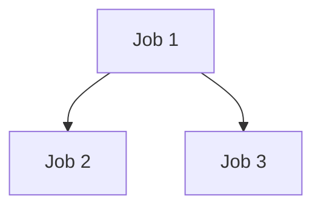

# Accessing the Cluster

---

## SSH to the Cluster
 

 Per the [Reference Documentation](https://computing.docs.ligo.org/guide/computing-centres/ldg/) there are two ways to do this.

This assumes you have an `ssh` client available!

---
### Some Conventions:
Text in special font is code that you can execute 
```sh
$ echo "Hello World"
```
Where the \\$ means this is a bash command. If you're copying code from these boxes, don't copy the \\$.

Also, whenever you see "albert.einstein" in this presentation (or LDG docs), substitute your own name!

---
### The SSH Portal
```sh
$ ssh albert.einstein@ssh.ligo.org
```
This gives you a list of all the head nodes to choose from, which is good!

But, it requires you to put in your password, which is annoying.

---
### SSH Directly
```sh
$ ssh albert.einstein@node.cluster
```
If you have an ssh key registered, this lets you skip your password!

But, you do need to specify the node to use. Luckily there are a few standard nodes to use.

---
## Setting up an SSH Key

---
### Making an SSH key

```sh
$ ssh-keygen -t ed25519
```

You'll be prompted for a file name and a password. The default filename is just `ed25519`, which is likely fine for most purposes.

---
### Adding Your SSH Key

Now in `~/.ssh` you should have a file `filename.pub` (where filename is what you gave above). 

Upload this at [this website](https://ldg.ligo.org/ldg/manage_ssh/)

---
### Bonus: Aliasing Your Login
To make things more convenient, you can add a line like this to `~/.bashrc` or `~/.zshrc` *on your own computer*:

```sh
alias ssh-cit-5='ssh albert.einstein@ldas-pcdev5.ligo.caltech.edu' 
```
Then whenever you type `ssh-cit-5` you will automatically ssh to pcdev-5!

---

### Bonus: Using Your Key for Github/Gitlab

In github:

`Profile (Top Right) -> Settings -> SSH and GPG Keys -> New SSH Key`

In gitlab:

`Profile (Top Left) -> Preferences -> SSH Keys -> Add New Key`

---
# Navigating the Cluster

---

## Directories on the Cluster

---

### Your Home Directory

All of your files are located at `/home/albert.einstein`, which you can also access as `~`

---

### What's in Your Home Directory? 

Try `ls` in your home directory. If you haven't done anything yet, this should show a single directory called `public_html`

---

### What's `public_html`?

Things in this directory are viewable in a browser. Try making a file here by doing:
```sh
$ cd public_html
$ echo 'These are some words' > test.txt
```
`echo` is a unix command which just prints text , and `>` tells it to go to a file. Now go to 
```sh
https://ldas-jobs.ligo.caltech.edu/albert.einstein/~
```
And check out the file you wrote. You should see it there as `test.txt`

---

### Other People's Home Directory

By default, cluster permissions allow everyone to read each other's home directories.*

So, try doing 
```sh
$ cd /home/rhiannon.udall/SURF_Software_Seminars
```
and `ls` to see the contents. Then read the file by doing

```sh
$ cat ExampleFile.txt
```

---

# Environments and Installation

---

## conda

- When you're installing different software, it helps to isolate your experiments in *environments*
- Conda is an environment manager that does this, and let's you install software easily
---
### Activating a `conda` Environment

To activate an environment, you do
```sh
$ conda activate environment-name
```
On the cluster, conda is pre-loaded with many `igwn` environments. If you are only using standard code, use one of these! In general, this one works best:
```
$ conda activate igwn
```

---


### Seeing What `conda` Environments are Available

To see all of your options, you can do
```sh
$ conda info --envs
```
And this will list all of the environments. There are a lot of `igwn` environments! Of note are ones like `igwn-py3x` which fix the version of python. 

---
### Making a `conda` Environment

If you need to install your own code, you can make an environment with:
```sh
$ conda create -n MyEnvironment
```
This will make a new environment. Then you install python with 
```sh
$ conda install python=3.x
```
Where x is the version you want (3.11 is a good stable choice).


---
### Installing a Package with `conda`

To install a new package, we use the same syntax as before, for example:

```sh
$ conda install bilby
```
This installs the latest version of bilby. Many packages can be installed like this, but not all. `pip` handles those.

---

## Installing a Package with pip

---

### From pypi

If the package you need isn't on `conda`, you can use `pip`. If you are installing from `pypi`, then:

```sh
$ pip install package
```
---
### Bonus: From Source

If the code isn't on `pypi` (in other words, you probably wrote it!) you can install from source with:
```sh
$ pip install .
```
You can also make the environment update with changes by doing 
```sh
$ pip install -e .
```

---
# HTCondor

---
## In The Abstract

---

### How Clusters are Structured

- The cluster has *many* CPUs, but how do you split them between users?
- Some of these are *head nodes* that you can login to directly, but most are *worker nodes* that are managed by a *scheduler*: that's htcondor

---
### What HTCondor Does
- The user submits configurations in two forms: *submit* files and a *dag* file.
- Submit files contain instructions for one job, dags contain instructions to chain the jobs together
---
### Directed Acyclic Graphs
- Directed: go from A to B
- Acyclic: No loops



---
## In Practice

---

### Get the Example Files

In your own directory make an `ExampleCondor` directory:
```sh
$ mkdir ~/ExampleCondor
```
Copy the example files into this directory:
```sh
$ cp /home/rhiannon.udall/SURF_Software_Seminars/Condor/* ~/CondorExample
```
`*` is the unix wildcard symbol

---
### A Deeper Look at These Files

Let's look at the `.sub` file in a text editor
```sh
$ cd CondorExample
$ vi CondorExample.sub
```
There's a lot in here!

\* I am using vim but if you're familiar with something else feel free to use it. 

---
### Setting The File Up to Run
In this example file, three of the lines tell condor where to put the log files:
```
log = /home/rhiannon.udall/SURF_Software_Seminars/Condor/$(MACROID).log
output = /home/rhiannon.udall/SURF_Software_Seminars/Condor/$(MACROID).out
error = /home/rhiannon.udall/SURF_Software_Seminars/Condor/$(MACROID).err
```
Go to insert mode by pressing `i`, then change
```
/home/rhiannon.udall/SURF_Software_Seminars/Condor
```
 to the directory you are in right now. Save by pressing `esc`, then typing `:x` and entering.

---
### The `.dag` File

Now let's look at the dag. We don't need to edit anything, so just do:
```bash
$ cat CondorExample.dag
```
Again, some things here. Let's focus on:
```
Parent ExampleJob1 Child ExampleJob2
Parent ExampleJob1 Child ExampleJob3
```
This means that `ExampleJob1` will run first, then when it finishes `ExampleJob2` and `ExampleJob3` will run.

---
### Submitting the Job

To submit the job do

```bash
$ condor_submit_dag CondorExample.dag
```
A bunch of files will be generated. For now don't worry about them too much. However, if something goes wrong in the future, note that the `.dagman.out` file will be the most useful.

---

### Checking on your job

To see what's happening with your job, you can do 
```sh
$ condor_q
```
```sh
-- Schedd: ldas-pcdev5.ligo.caltech.edu : <10.14.0.51:9618?... @ 06/18/24 15:37:32
OWNER          BATCH_NAME                     SUBMITTED   DONE   RUN    IDLE  TOTAL JOB_IDS
rhiannon.udall CondorExample.dag+158061372   6/18 15:37      _      _      1      3 158061373.0

Total for query: 1 jobs; 0 completed, 0 removed, 1 idle, 0 running, 0 held, 0 suspended 
Total for rhiannon.udall: 1 jobs; 0 completed, 0 removed, 1 idle, 0 running, 0 held, 0 suspended 
Total for all users: 4633 jobs; 0 completed, 0 removed, 2016 idle, 1133 running, 1484 held, 0 suspended
```
This shows the *JOB_ID* for the various jobs, and their statuses. Right now Job1 is idling, so it has submitted but condor hasn't found a node to run it yet.

---

Now the job switches to running:

```sh
-- Schedd: ldas-pcdev5.ligo.caltech.edu : <10.14.0.51:9618?... @ 06/18/24 15:39:12
OWNER          BATCH_NAME                     SUBMITTED   DONE   RUN    IDLE  TOTAL JOB_IDS
rhiannon.udall CondorExample.dag+158061372   6/18 15:37      _      1      _      3 158061373.0

Total for query: 1 jobs; 0 completed, 0 removed, 0 idle, 1 running, 0 held, 0 suspended 
Total for rhiannon.udall: 1 jobs; 0 completed, 0 removed, 0 idle, 1 running, 0 held, 0 suspended 
Total for all users: 4621 jobs; 0 completed, 0 removed, 2015 idle, 1122 running, 1484 held, 0 suspended
```

Now read the output file `Example1.out`:
```sh
$ cat Example1.out
```
---

### HTCondor Summary

In general, you should not need to write condor files yourself (if you do, there are python packages for that).

But, it's important to know how to check on them, and find the outputs when bugfixing!

---
# IDEs and Linting

---

### Why You Should Use Them

- Code highlighting makes it *much* easier for you to follow what's going on
- Integrated file systems help a lot when pointing to files
- Modern linters will catch your bugs before you even make them!
- The in-browser `jupyter` servers are often unstable / bug prone (not to say every IDE is perfect, but in my experience it works better)

---
### Some Options
- Anecdotally [VS Code](https://code.visualstudio.com/) is used by most of the grads/post-docs
	- I can also guarantee that it works on the cluster via the `ssh` extension and has a `jupyter` extension
- Other options include [pycharm](https://www.jetbrains.com/pycharm/) and [spyder](https://www.spyder-ide.org/)

---

# Conclusion

---
## Final Thoughts

 Coding doesn't need to suck! 

If something seems really obnoxious or difficult, smart people have probably made tools or found techniques to make it better. 

These seminars will introduce you to some of these things, but also seek them out on your own!

---
## Useful Resources

- A [unix commands cheatsheet](https://www.geeksforgeeks.org/linux-commands-cheat-sheet/)
- 